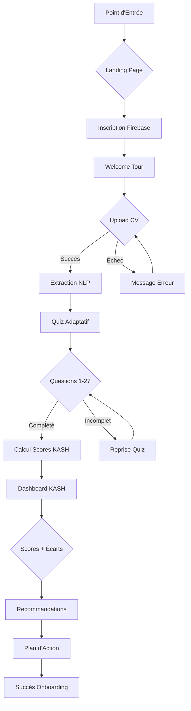
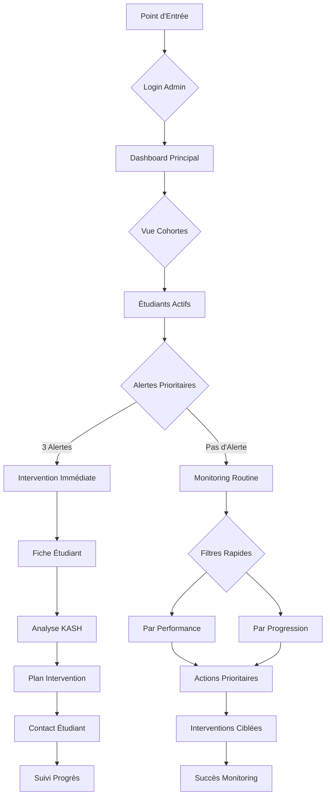

# UX Design Specification yes

**Author:** rida
**Date:** 2026-02-14

---

<!-- UX design content will be appended sequentially through collaborative workflow steps -->

## Executive Summary

### Project Vision

KASH Career Intelligence Platform transforme l'incertitude académique et professionnelle des étudiants en un parcours de développement clair et personnalisé. En combinant scoring KASH multimodal, analyse CV intelligente et recommandations ML explicable, la plateforme crée un pont entre les compétences actuelles des étudiants et leurs objectifs de carrière, tout en fournissant aux conseillers les outils pour un accompagnement ciblé et efficace.

### Target Users

**Persona Primaire - Lina (20 ans, Étudiante en transition)**
- **Contexte** : Indécise entre psychologie et communication, a essayé tests génériques sans succès
- **Besoins UX** : Interface mobile-first, auto-évaluation intuitive, plan d'action visuel et concret
- **Moment magique** : Voir ses compétences réelles, métiers compatibles et formations spécifiques en un dashboard cohérent

**Persona Primaire - M. Karim (35 ans, Conseiller pédagogique)**  
- **Contexte** : Gère 200+ étudiants, données dispersées, interventions chronophages
- **Besoins UX** : Dashboard centralisé, alertes intelligentes, priorisation rapide, reporting efficace
- **Moment magique** : Vue consolidée avec alertes automatiques permettant des interventions ciblées en temps réel

### Key Design Challenges

**Complexité technique simplifiée** : Transformer l'analyse NLP, scoring KASH et ML explicable en expérience intuitive pour utilisateurs niveau intermédiaire sans sacrifier la puissance des algorithmes.

**Double audience UX** : Créer une architecture d'interface qui sert à la fois Lina (mobile, auto-évaluation) ET M. Karim (desktop, gestion cohortes) avec des workflows adaptés mais une base de données commune.

**Confiance et actionnabilité** : Présenter les recommandations ML de manière compréhensible et fiable, en utilisant SHAP explainability de façon visuelle pour construire la confiance et encourager l'action.

### Design Opportunities

**Dashboard KASH visuel transformateur** : Créer une expérience "wow" où Lina voit instantanément la transformation de son CV et quiz en profil de compétences clair avec plan d'action personnalisé.

**Intelligence visible et compréhensible** : Utiliser des visualisations innovantes pour présenter SHAP explainability de manière accessible, rendant les recommandations ML transparentes et dignes de confiance.

**Workflow conseiller-étudiant intégré** : Développer une interface partagée qui facilite les discussions basées sur données, permettant à M. Karim de guider Lina avec des insights concrets et des plans de progression mesurables.

## Core User Experience

### Defining Experience

L'expérience centrale de KASH réside dans **"Voir et comprendre son profil KASH avec recommandations actionnables"**. Le dashboard KASH est le cœur battant de la plateforme - là où Lina transforme son incertitude en plan d'action clair, et où M. Karim identifie les interventions prioritaires. Toutes les autres fonctionnalités (upload CV, quiz adaptatif, scoring ML) existent pour alimenter cette expérience centrale de visualisation et compréhension.

### Platform Strategy

**Approche Responsive Web avec Device-Optimization** :
- **Mobile-First pour Lina** : Interface tactile optimisée, notifications push, navigation simplifiée
- **Desktop-Optimized pour M. Karim** : Dashboards complets, multi-vues, analyse de cohortes
- **Fonctionnalité Hors-Ligne Optionnelle** : Quiz et lecture CV offline pour Lina, non-critique pour M. Karim
- **Capacités Exploitées** : Drag & drop CV upload, visualisations dynamiques (Recharts/D3), notifications intelligentes

### Effortless Interactions

**Complètement Automatique et Naturel** :
- Upload CV → extraction NLP + scoring KASH instantané
- Dashboard clair dès la première connexion avec scores interprétables
- Recommandations formations/métiers automatiquement mises en avant

**Élimination de la Friction** :
- Zéro formulaire long - tout est guidé et contextuel
- Navigation simplifiée - tout mène au dashboard central
- Compréhension immédiate des priorités sans effort cognitif

**Moments de Delight** :
- Visualisation instantanée des progrès et écarts
- Recommandations ultra-personnalisées basées sur quiz + CV
- "Aha moments" quand les compétences deviennent visibles et actionnables

### Critical Success Moments

**Moments "Wow" Transformateurs** :
- Premier dashboard affiché avec scoring KASH clair → "ceci est meilleur que les tests génériques"
- Identification automatique des écarts compétences avec visualisation intuitive
- Plan d'action personnalisé qui répond directement à l'incertitude de Lina

**Succès Utilisateur Mesurable** :
- Lina comprend ses forces/faiblesses ET sait exactement quoi faire ensuite
- M. Karim voit en un coup d'œil quels étudiants nécessitent une attention prioritaire
- Les deux personas se sentent "outillés" plutôt que "submergés"

**Workflows Make-or-Break** :
- Upload CV + scoring KASH (doit être transparent et instantané)
- Quiz adaptatif → génération vecteur Abilities (doit être engageant)
- Dashboard étudiant & alertes conseiller (doivent être impeccables)

### Experience Principles

**1. Clarté Absolue** : Le dashboard est le cœur de l'expérience - chaque élément doit être immédiatement compréhensible et actionnable.

**2. Automatisation Intelligente** : Réduire au minimum les actions manuelles - l'utilisateur se concentre sur la compréhension, pas sur la saisie.

**3. Responsive Device-Optimized** : Mobile-first pour Lina (touch, notifications), Desktop-first pour M. Karim (dashboards, données).

**4. Delight par Feedback Immédiat** : Chaque interaction doit fournir une récompense visuelle ou informationnelle instantanée.

**5. Make-or-Break Impeccable** : Dashboard + scoring doivent être parfaits - toute l'expérience dépend de cette fondation.

## Desired Emotional Response

### Primary Emotional Goals

**Lina (Étudiante) : Empowerment Personnel**
- **Clarté** : Transformation de l'incertitude en compréhension nette de ses compétences
- **Confiance** : Sentiment que ses choix académiques/professionnels sont informés et justifiés
- **Sécurité** : Assurance que le parcours proposé est réaliste et atteignable

**M. Karim (Conseiller) : Efficacité Professionnelle**
- **Contrôle** : Visibilité complète et priorisation intelligente de ses interventions
- **Satisfaction** : Sentiment d'accomplissement en guidant efficacement chaque étudiant
- **Confiance Outil** : KASH devient un partenaire quotidien indispensable

### Emotional Journey Mapping

**Phase de Découverte**
- Lina : Curiosité → Espoir ("enfin quelque chose qui pourrait m'aider")
- M. Karim : Intérêt pragmatique → Curiosité ("gain de temps possible ?")

**Expérience Centrale (Dashboard KASH)**
- Lina : Confiance croissante → Compréhension → "Je vois qui je suis et où je vais"
- M. Karim : Contrôle → Efficacité → "Je sais exactement qui aider et comment"

**Après Accomplissement**
- Lina : Empowerment → Clarté d'action → "Je sais quoi faire maintenant"
- M. Karim : Satisfaction → Capacité d'action priorisée → "Mon travail est transformé"

**Gestion des Problèmes**
- Lina : Soutien → Guidance (jamais de frustration ou d'abandon)
- M. Karim : Alerts intelligentes → Solutions contextuelles (pas de perte de temps)

**Fidélisation**
- Lina : Familiarité → Confiance accrue → "KASH est mon guide carrière"
- M. Karim : Dépendance positive → Intégration workflow → "Je ne peux plus travailler sans KASH"

### Micro-Emotions

**Confiance vs Confusion** : Scoring KASH et quiz doivent être transparents et interprétables instantanément

**Confiance vs Scepticisme** : Recommandations ML avec SHAP explainability simplifiée pour construire la crédibilité

**Excitation vs Anxiété** : Parcours carrière présenté comme opportunité, pas comme pression

**Accomplissement vs Frustration** : Feedback immédiat et progressif à chaque étape du parcours

**Delight vs Satisfaction** : Visualisations interactives et micro-interactions agréables

**Appartenance vs Isolement** : Lina se sent comprise, M. Karim se soutenu dans sa mission

### Design Implications

**Pour Créer Clarté et Confiance**
- **Visualisations Transparentes** : Graphiques KASH lisibles, couleurs cohérentes, légendes claires
- **Feedback Progressif** : Confirmation après chaque action (quiz, CV upload, recommandation)
- **Explications Accessibles** : SHAP explainability présentée de manière intuitive et non-technique

**Pour Éviter Anxiété et Confusion**
- **Interface Épurée** : Focus sur actions clés, pas de surcharge informationnelle
- **Guidance Contextuelle** : Tooltips intelligents, mini-tutoriels situationnels
- **Langage Encourageant** : Ton positif, vocabulaire motivant, messages de soutien

**Pour Créer Delight et Différenciation**
- **Micro-interactions** : Animations subtiles, transitions fluides, feedback visuel
- **Personnalisation** : Interface qui s'adapte au profil et au progrès de l'utilisateur
- **Moments "Aha"** : Révélation progressive des insights et compétences

### Emotional Design Principles

**1. Clarté avant Complexité** : Chaque élément complexe (ML, scoring) doit être présenté de manière compréhensible

**2. Confiance par Transparence** : Les algorithmes et recommandations doivent être explicables, pas une "boîte noire"

**3. Empowerment par Action** : Chaque insight doit être accompagné d'une action concrète et réalisable

**4. Soutien Constant** : Aucun utilisateur ne doit se sentir perdu ou frustré à aucun moment

**5. Différenciation par Delight** : Dépasser la fonctionnalité pour créer une expérience mémorable et partageable

## UX Pattern Analysis & Inspiration

### Inspiring Products Analysis

**LinkedIn - Le Power User du Profil Professionnel**
- **Ce qu'il fait bien** : Profils détaillés avec scoring compétences implicite, recommandations personnalisées, système d'alerts intelligent
- **Delight factor** : Visualisation claire des compétences, suggestions métiers contextuelles, sentiment de progression professionnelle
- **Leçon pour KASH** : Transparence du scoring KASH, système de recommandations métiers visibles, alertes contextuelles

**Duolingo - Maître de la Gamification Engageante**
- **Ce qu'il fait bien** : Progression visible, feedback instantané, streaks motivants, micro-achievements constants
- **Delight factor** : Sentiment d'accomplissement quotidien, progression tangible, motivation intrinsèque
- **Leçon pour KASH** : Système de progression KASH gamifié, badges de compétences, feedback immédiat sur quiz/CV

**Notion - Roi de la Clarté Visuelle**
- **Ce qu'il fait bien** : Dashboards personnalisables, interface épurée, contrôle total sur l'affichage, templates flexibles
- **Delight factor** : Sentiment de contrôle et organisation, clarté mentale, efficacité personnelle
- **Leçon pour KASH** : Dashboard KASH personnalisable pour Lina, vue cohortes pour M. Karim, interface épurée

**Headspace - Maître du Ton Encourageant**
- **Ce qu'il fait bien** : Langage positif constant, guidance progressive, micro-feedback émotionnel, interface rassurante
- **Delight factor** : Sentiment de soutien, sécurité émotionnelle, progression bienveillante
- **Leçon pour KASH** : Messages encourageants, ton positif dans les recommandations, guidance contextuelle

### Transferable UX Patterns

**Patterns de Gamification Légère**
- **Progression Visible** : Système de niveaux KASH avec scores Knowledge/Abilities/Skills/Intelligence
- **Micro-Achievements** : Badges pour complétion quiz, upload CV, première recommandation suivie
- **Streaks Motivants** : Connexion hebdomadaire pour suivre progrès, maintenir engagement

**Patterns de Dashboard Intelligent**
- **Double Interface** : Mobile-first simple pour Lina, desktop-complet pour M. Karim
- **Visualisation de Données** : Graphiques KASH clairs, écarts compétences visibles, compatibilités métiers
- **Filtrage Contextuel** : Recherche métiers par compétences, alertes étudiants à risque pour conseillers

**Patterns de Feedback Immédiat**
- **Confirmation Progression** : Chaque action validée par feedback visuel positif
- **Transparence Algorithmique** : SHAP explainability présentée simplement pour construire la confiance
- **Guidance Contextuelle** : Tooltips intelligents, mini-tutoriels situationnels

**Patterns de Ton Emotionnel**
- **Langage Encourageant** : Messages positifs, vocabulaire motivant, approche bienveillante
- **Guidance Progressive** : Révélation graduelle des informations, pas de surcharge initiale
- **Support Constant** : Messages d'aide contextuels, sentiment de soutien permanent

### Anti-Patterns to Avoid

**Surcharge Informationnelle**
- Éviter les dashboards avec trop de métriques simultanément
- Ne pas présenter tous les détails ML techniques aux utilisateurs
- Pas de navigation complexe entre sections

**Gamification Excessive**
- Éviter les points/badges sans valeur réelle perçue
- Pas de compétition entre étudiants (contraire à l'objectif de bien-être)
- Ne pas transformer l'apprentissage en jeu purement

**Interface Générique**
- Éviter les templates standards sans personnalisation KASH
- Pas de ton corporatif froid et impersonnel
- Ne pas copier LinkedIn sans adaptation au contexte étudiant

**Manque de Transparence**
- Éviter les recommandations "boîte noire" sans explication
- Pas de scoring KASH sans interprétation accessible
- Ne pas cacher la logique derrière les suggestions

### Design Inspiration Strategy

**What to Adopt**
- **Progression Gamifiée (Duolingo)** : Scoring KASH visible, badges compétences, feedback immédiat
- **Dashboard Personnalisable (Notion)** : Interface adaptable selon persona (Lina vs M. Karim)
- **Ton Encourageant (Headspace)** : Messages positifs, guidance bienveillante, soutien constant

**What to Adapt**
- **Recommandations Contextuelles (LinkedIn)** : Adapter pour contexte étudiant/conseiller, pas professionnel pur
- **Visualisation Données (Notion)** : Simplifier pour niveau technique intermédiaire, pas power users
- **Gamification (Duolingo)** : Adoucir pour focus sur bien-être et clarté, pas pure performance

**What to Avoid**
- **Complexité LinkedIn** : Éviter profils surchargés, garder focus sur KASH essentiel
- **Compétition Duolingo** : Pas de classements, focus sur progression personnelle
- **Interface Trop Technique (Notion)** : Maintenir simplicité pour utilisateurs niveau intermédiaire

**Stratégie KASH Unique** : Combiner clarté visuelle (Notion) + progression engageante (Duolingo) + ton bienveillant (Headspace) + recommandations intelligentes (LinkedIn) = expérience unique qui transforme l'incertitude en empowerment.

## Design System Foundation

### Design System Choice

**Recommandation : Système Thémable (MUI + Tailwind UI)**

Pour KASH, je recommande une approche hybride combinant **MUI (Material-UI)** comme fondation principale avec **Tailwind UI** pour les layouts personnalisés et animations gamifiées.

### Rationale for Selection

**Vitesse et MVP**
- MUI fournit des composants dashboard éprouvés (tables, charts, cards)
- Développement rapide pour MVP avec patterns fiables
- Documentation complète et communauté active

**Flexibilité Visuelle pour Double Audience**
- Thémage complet pour adapter Lina (mobile, ton doux) vs M. Karim (desktop, professionnel)
- Composants réutilisables responsive
- Personnalisation avancée des tokens de design

**Support des Patterns UX KASH**
- Dashboards visuels : Grid system, charts, tables avancées
- Gamification : Badges, progressions, animations
- Ton encourageant : Typographie, couleurs, micro-interactions

**Maintenance et Évolution**
- Mises à jour automatiques des composants core
- Architecture évolutive pour Phase 2 (custom components)
- Écosystème React mature

### Implementation Approach

**Phase 1 (MVP)**
1. **MUI Core** : Composants dashboard (DataGrid, Charts, Cards)
2. **Thème KASH** : Tokens de design personnalisés (couleurs, typographie)
3. **Tailwind UI** : Layouts personnalisés et animations gamifiées

**Phase 2 (Post-MVP)**
1. **Custom Components** : Composants KASH spécifiques (scoring visualizations)
2. **Design System Étendu** : Documentation interne des patterns KASH
3. **Animation Library** : Micro-interactions et delight moments

### Customization Strategy

**Tokens de Design KASH**
- **Palette Primaire** : Bleus confiance (scoring) + verts croissance (progrès)
- **Palette Secondaire** : Oranges encouragement (gamification) + gris neutres (dashboards)
- **Typographie** : Inter (clarté) + Poppins (personnalité)
- **Espacement** : Système 8px base pour cohérence responsive

**Thèmes Double Audience**
- **Thème Lina** : Couleurs douces, typographie amicale, animations légères
- **Thème M. Karim** : Couleurs professionnelles, densité informationnelle élevée, interface efficace

**Composants Custom KASH**
- KASHScoreCard : Visualisation scoring avec SHAP explainability
- ProgressRing : Gamification progression visible
- RecommendationCard : Recommandations actionnables avec ton encourageant
- AlertDashboard : Vue conseiller avec priorisation intelligente

**Intégration Technique**
- React 14 + Next.js pour performance responsive
- MUI v5 avec emotion-in-js pour thémage avancé
- Tailwind CSS v3 pour layouts utilitaires
- Framer Motion pour animations gamifiées

## 2. Core User Experience

### 2.1 Defining Experience

**KASH : "Transformez votre incertitude en plan d'action clair avec scoring KASH intelligent"**

L'action que les utilisateurs partageront à leurs amis :
*"J'ai téléchargé mon CV et fait un quiz, et KASH m'a montré exactement où je suis forte/faible et quoi faire ensuite."*

**Interaction clé à perfectionner** : Le dashboard KASH qui affiche scores, écarts compétences, recommandations métiers et formations. Tout le reste (quiz, CV upload, vecteurs Abilities) alimente cette expérience centrale.

### 2.2 User Mental Model

**Lina (Étudiante)**
- **Modèle mental** : "Je veux savoir où je me situe et quoi faire ensuite"
- **Attentes** : Visualisation claire et rapide, recommandations concrètes, scoring fiable, progression mesurable
- **Points de friction potentiels** : Interprétation du scoring, écarts compétences mal présentés

**M. Karim (Conseiller)**
- **Modèle mental** : "Je veux identifier rapidement les étudiants qui ont besoin d'aide et prioriser mes actions"
- **Attentes** : Dashboard centralisé, alertes intelligentes, vue d'ensemble efficace
- **Points de friction potentiels** : Navigation entre dashboards, surcharge informationnelle

**Solutions Actuelles - Likes/Dislikes**
- **Tests en ligne** : Simples rapides ❌ Trop génériques, pas personnalisés
- **CV + recommandations** : Indiquent pistes ❌ Peu clairs, pas actionnables  
- **Dashboards existants** : Aperçu global ❌ Trop complexes, dispersés, peu guidés

### 2.3 Success Criteria

**Feedback Immédiat et Compréhensible**
- Scoring et recommandations KASH s'affichent en 3-5 secondes maximum
- Visualisation instantanée des scores Knowledge/Abilities/Skills/Intelligence
- Interprétation accessible sans expertise technique

**Sentiment d'Accomplissement**
- Lina voit son plan d'action clair → "Je sais quoi faire maintenant"
- M. Karim identifie étudiants prioritaires → "Je peux agir efficacement"
- Chaque interaction renforce le sentiment de contrôle et progression

**Automaticité et Fluidité**
- Extraction CV, calcul score, suggestions métiers/formations → sans effort manuel
- Navigation intuitive entre dashboard et détails
- Contexte préservé lors de l'exploration

**Delight par Micro-Interactions**
- Visualisation interactive des écarts compétences
- Progression gamifiée avec mini-achievements pour Lina
- Alertes pertinentes et priorisation pour M. Karim

### 2.4 Novel UX Patterns

**Patterns Établis Adaptés**
- **Dashboard Pattern** : Adapté de Notion/LinkedIn pour double audience
- **Progress Visualization** : Inspiré de Duolingo pour gamification légère
- **Recommendation Cards** : Pattern Netflix/LinkedIn pour suggestions actionnables

**Innovation KASH**
- **Scoring KASH Visual** : Combinaison unique de 4 dimensions (Knowledge/Abilities/Skills/Intelligence) avec SHAP explainability
- **Dual-Audience Interface** : Mobile-first motivant pour Lina + desktop-efficient pour M. Karim
- **Gap Visualization** : Écarts compétences présentés comme opportunités, pas faiblesses

### 2.5 Experience Mechanics

**1. Initiation**
- **Trigger** : Upload CV ou démarrage quiz adaptatif
- **Invitation** : Interface engageante avec promesse claire de valeur
- **Guidance** : Steps simples avec feedback progressif

**2. Interaction Core**
- **Action Utilisateur** : Upload CV + réponses quiz (minimal effort)
- **Traitement Système** : Extraction NLP + scoring KASH + calcul recommandations
- **Feedback Immédiat** : Dashboard KASH avec scores, écarts, suggestions

**3. Feedback Loop**
- **Visualisation** : Graphiques clairs des 4 scores KASH
- **Interprétation** : SHAP explainability simplifiée pour confiance
- **Actionnabilité** : Recommandations métiers/formations avec liens directs

**4. Completion et Continuation**
- **Succès** : Plan d'action personnalisé visible et compréhensible
- **Prochaine Étape** : Exploration métiers, début formations, suivi progrès
- **Rétention** : Notifications hebdomadaires, check-in progression

**Double Interface Mechanics**
- **Lina Mobile** : Swipe-friendly, focus gamification, ton encourageant
- **M. Karim Desktop** : Tableaux données, filtres avancés, vue cohortes

## Visual Design Foundation

### Color System

**Palette Principale KASH - Alignée sur Objectifs Émotionnels**

| Objectif Émotionnel | Couleur | Hex | Usage UX Prioritaire |
|---|---|---|---|
| **Confiance & Fiabilité** | Bleu Profond | `#1E3A8A` | Scoring KASH, dashboards principaux, titres importants |
| **Croissance & Progrès** | Vert Croissance | `#10B981` | Visualisation écarts compétences, gamification, badges progression |
| **Clarté & Professionnalisme** | Gris Neutre | `#F3F4F6` / `#374151` | Backgrounds, cartes, contenus secondaires |
| **Encouragement & Bienveillance** | Orange encouragement | `#F59E0B` | Feedback positif, alertes légères, micro-achievements |
| **Accent & Interactions** | Violet dynamique | `#8B5CF6` | Boutons principaux, liens, hover states |

**Système de Couleurs Sémantiques**
- **Primary** : Bleu `#1E3A8A` (actions principales, scoring)
- **Success** : Vert `#10B981` (progrès, achievements)
- **Warning** : Orange `#F59E0B` (alertes, encouragement)
- **Info** : Violet `#8B5CF6` (interactions, liens)
- **Neutral** : Gris `#F3F4F6` (backgrounds, cartes)
- **Text** : Gris foncé `#374151` (textes principaux)

**Accessibilité** : Tous les contrastes respectent WCAG AA minimum (4.5:1)

### Typography System

**Stratégie Typographique - Moderne, Professionnel, Accessible**

**Hiérarchie Typographique**
- **H1 - Titres Principaux** : Inter Semi-Bold 32px / 40px line-height
- **H2 - Sous-titres** : Inter Semi-Bold 24px / 32px line-height  
- **H3 - Sections** : Inter Medium 20px / 28px line-height
- **Body - Texte Corps** : Inter Regular 16px / 24px line-height
- **Small - Texte Secondaire** : Inter Regular 14px / 20px line-height
- **Caption - Légendes** : Inter Regular 12px / 16px line-height

**Pairing de Polices**
- **Primaire** : Inter (moderne, lisible, excellent pour écrans)
- **Alternative** : Roboto (fallback robust, large écosystème)
- **Accent** : Poppins (pour éléments spéciaux, badges, gamification)

**Accessibilité Typographique**
- Taille de base 16px pour confort lecture
- Line-height 1.5 pour lisibilité optimale
- Font weights : Regular (400) → Medium (500) → Semi-Bold (600) → Bold (700)

### Spacing & Layout Foundation

**Système d'Espacement - Modulaire 8px**

**Unités de Base**
- **XS** : 4px (micro-espacements, borders)
- **SM** : 8px (éléments rapprochés, padding petits)
- **MD** : 16px (padding standards, margins)
- **LG** : 24px (sections, espacements entre cartes)
- **XL** : 32px (grandes sections, hero areas)
- **2XL** : 48px (espacements majeurs, footer)

**Système de Grille**
- **Structure** : 12 colonnes responsive
- **Mobile (Lina)** : 4 colonnes max, focus vertical
- **Desktop (M. Karim)** : 12 colonnes complètes, layout horizontal
- **Gutters** : 16px (mobile) → 24px (desktop)

**Principes de Layout**
- **Aéré et Lisible** : Éviter surcharge pour dashboards complexes
- **Cartes Distinctes** : Espacement clair entre sections
- **Micro-espacement** : Consistance pour boutons et labels
- **Graphiques Breathing Room** : Padding suffisant autour visualisations

### Accessibility Considerations

**Contraste et Lisibilité**
- Tous les textes respectent WCAG AA (4.5:1 minimum)
- Textes importants en WCAG AAA (7:1)
- Testés avec simulateurs daltonisme

**Navigation et Interaction**
- Focus states visibles (2px outline violet `#8B5CF6`)
- Hover states clairs avec transitions subtiles
- Touch targets minimum 44px pour mobile

**Structure Sémantique**
- Hiérarchie visuelle correspond à hiérarchie d'information
- Labels clairs pour tous les éléments interactifs
- Alternatives textes pour icônes et graphiques

**Performance Visuelle**
- Palette limitée pour cohérence et performance
- Transitions CSS optimisées (200ms ease-out)
- Images et illustrations optimisées pour web

## Design Direction Decision

### Design Directions Explored

**6 Directions de Design Générées et Évaluées :**

1. **Clean & Minimal** - Layout aéré, focus clarté essentiel, idéal pour Lina
2. **Data-Rich** - Dashboard dense, informations complètes, parfait pour M. Karim
3. **Gamified** - Progression visible, badges engageants, très motivateur pour Lina
4. **Professional** - Équilibre corporate, dashboards structurés, bon compromis
5. **Mobile-First** - Optimé mobile, swipe-friendly, compact pour Lina
6. **Dark Mode** - Moderne, réduction fatigue oculaire, option alternative

**Méthodologie d'Évaluation :**
- Filtres par persona (Lina vs M. Karim)
- Critères UX : layout intuitif, poids visuel, style interaction
- Focus sur dashboard KASH central comme expérience clé
- Analyse d'alignement avec objectifs émotionnels

### Chosen Direction

**Direction Hybride : Professional + Clean + Gamified**

**Base Principale : Direction 4 (Professional)**
- Layout équilibré avec grille 3x3 pour scores KASH
- Progress bars visuelles pour chaque dimension
- Couleurs cohérentes avec notre fondation établie
- Fonctionne pour les deux personas

**Éléments Additionnels :**
- **De Direction 1 (Clean)** : Espacement aéré, hiérarchie claire pour Lina
- **De Direction 3 (Gamified)** : Badges et progression visible pour engagement
- **De Direction 2 (Data-Rich)** : Vue détaillée optionnelle pour M. Karim

**Approche Double Interface :**
- **Vue Lina** : Layout épuré + gamification légère + ton encourageant
- **Vue M. Karim** : Densité augmentée + filtres + alertes prioritaires

### Design Rationale

**Alignement Parfait avec Besoins KASH :**

1. **Supporte Double Audience** : Base professionnelle adaptable selon persona
2. **Dashboard Central Optimisé** : Scores KASH clairs, écarts visibles, recommandations actionnables
3. **Évolutivité** : Structure permet ajout de features sans casser l'expérience
4. **Accessibilité** : Contrastes WCAG, hiérarchie claire, navigation intuitive

**Avantages UX Clés :**
- **Pour Lina** : Clarté immédiate + progression motivateur + guidance bienveillante
- **Pour M. Karim** : Efficacité professionnelle + priorisation intelligente + vue complète
- **Pour Produit** : Identité visuelle cohérente + différenciation + scalabilité

**Validation Objectifs Émotionnels :**
- **Confiance** : Layout professionnel, couleurs bleues fiabilité
- **Croissance** : Progress bars, badges gamification, vert succès
- **Clarté** : Espacement aéré, hiérarchie visuelle nette
- **Encouragement** : Ton positif, feedback progressif, micro-achievements

### Implementation Approach

**Phase 1 - Foundation (MVP)**
1. **Layout Professional Base** : Grille KASH 3x3 responsive
2. **Thème Double Persona** : Switch Lina/M. Karim avec adaptations
3. **Composants Core** : Score cards, progress bars, recommendation cards
4. **Gamification Légère** : Badges progression, feedback immédiat

**Phase 2 - Enhancement (Post-MVP)**
1. **Vue Data-Rich** : Dashboard détaillé pour M. Karim
2. **Mobile Optimization** : Direction 5 enhancements pour mobile Lina
3. **Advanced Gamification** : Streaks, achievements, social features
4. **Dark Mode Option** : Direction 6 comme alternative utilisateur

**Technical Implementation**
- **MUI Components** : Grid, Cards, Progress, Typography
- **Custom Components** : KASHScoreCard, ProgressRing, RecommendationCard
- **Responsive Strategy** : Mobile-first avec desktop enhancements
- **Theme System** : Tokens pour double persona + mode variations

**Success Metrics**
- **Lina** : ≥80% trouvent dashboard clair et motivateur
- **M. Karim** : ≥90% trouvent vue efficace et priorisée
- **Produit** : Cohérence visuelle, engagement maintenu, évolutivité technique

## User Journey Flows

### Lina Onboarding Journey

**Self-Discovery Student - Découverte → Dashboard KASH**

**Flow Diagram:**

**Étapes Détaillées:**

1. **Découverte & Inscription** - Landing engageante avec promesse "Transformez votre incertitude en plan d'action clair". Inscription via Firebase (Google/LinkedIn) en 30 secondes.

2. **Upload CV Intelligent** - Drag & drop CV avec feedback immédiat. Extraction NLP automatique, mapping compétences KASH. Messages encourageants pendant traitement.

3. **Quiz Adaptatif Gamifié** - 27 questions Vrai/Faux + Classement. Progress bar visible, micro-achievements chaque 5 questions. Ton encourageant, pas de pression.

4. **Révélation Dashboard KASH** - Moment "wow" avec scores Knowledge/Abilities/Skills/Intelligence. Visualisation écarts comme opportunités. SHAP explainability simplifiée.

5. **Plan d'Action Personnalisé** - Recommandations métiers + formations concrètes. Actions cliquables, prochaines étapes claires. Sentiment "Je sais quoi faire maintenant".

### M. Karim Monitoring Journey

**Pilot Admin/Counselor - Vue Cohortes → Interventions**

**Flow Diagram:**

**Étapes Détaillées:**

1. **Dashboard Conseiller Central** - Vue d'ensemble immédiate : 24 étudiants actifs, 3 alertes prioritaires, 89% taux complétion. Interface dense mais organisée.

2. **Alertes Intelligentes** - Système priorisation basé sur écarts compétences + inactivité. Alertes contextuelles avec actions suggérées. "Lina B. - Skills 65% - Suggérer formation Python".

3. **Fiche Étudiant Complète** - Vue détaillée KASH + historique + recommandations. SHAP explainability pour comprendre scores. Notes personnelles + plan intervention.

4. **Filtres et Priorisation** - Filtres rapides par performance, progression, métiers cibles. Vue cohortes avec comparaisons. Export rapports pour réunions.

5. **Interventions Efficaces** - Actions ciblées basées sur données KASH. Suivi automatique progrès post-intervention. Sentiment "Je peux guider chaque étudiant efficacement".

### Journey Patterns

**Navigation Patterns**
- **Progression Linéaire** : Onboarding avec options de retour flexibles
- **Dashboard Central** : Point d'ancrage pour toutes les actions
- **Filtres Rapides** : Accès direct aux informations pertinentes

**Decision Patterns**
- **Choix Guidés** : Recommandations par défaut avec option personnalisation
- **Validation Progressive** : Sauvegarde automatique à chaque étape
- **Actions Contextuelles** : Boutons pertinents basés sur état utilisateur

**Feedback Patterns**
- **Confirmation Immédiate** : Success states visuels après chaque action
- **Progression Visible** : Barres, pourcentages, étapes restantes
- **Micro-Achievements** : Badges, messages encourageants, moments "aha"

### Flow Optimization Principles

**Minimiser Time-to-Value**
- Dashboard KASH en 3-5 secondes post-upload CV + quiz
- Accès immédiat aux informations critiques
- Révélation progressive des fonctionnalités

**Réduire Charge Cognitive**
- Une action principale par écran
- Guidance contextuelle et tooltips intelligents
- Hiérarchie visuelle claire et prédictible

**Créer Moments Delight**
- Badges de progression et achievements
- Feedback visuel et sonore subtil
- Messages personnalisés et encourageants

**Gérer Erreurs Gracieusement**
- Messages d'erreur clairs et constructifs
- Suggestions correctives spécifiques
- Options de retry et récupération simples

**Assurer Success States Clairs**
- Dashboard complet avec toutes les métriques
- Plan d'action avec prochaines étapes visibles
- Interventions avec suivi et résultats mesurables

## Component Strategy

### Design System Components

**MUI + Tailwind Foundation (70% Standard Components)**

**Available from Design System:**
- Grid, Cards, Buttons, Typography, Progress bars
- Tables, DataGrid, Charts, Navigation components
- Forms, Inputs, Modals, Toolips, Dialogs
- Layout foundations (Container, Stack, Box)
- Color system, spacing, typography tokens

**Foundation Benefits:**
- Proven patterns with extensive documentation
- Built-in accessibility and responsive behavior
- Large community support and regular updates
- Consistent design language across components

### Custom Components

**KASH-Specific Components (30% Custom Development)**

### KASHScoreCard

**Purpose:** Dashboard central affichant les 4 scores KASH (Knowledge, Abilities, Skills, Intelligence) avec indicateur global de progression

**Usage:** Cœur de l'expérience étudiante, point d'ancrage pour toutes les actions KASH

**Anatomy:**
- 4 score cards avec valeurs numériques (0-100%)
- Progress bars visuelles par dimension
- Score global pondéré avec badge niveau
- Timestamp dernière mise à jour
- Actions: détails dimension, tooltip explication, partage profil

**States:** Default, Hover, Loading, Error, Success
**Variants:** Student (compact, gamifié), Admin (dense, détaillé), Mobile (vertical)

**Accessibility:** ARIA labels pour scores, keyboard navigation, screen reader support

### ProgressRing

**Purpose:** Visualisation circulaire de progression avec gamification pour engagement et motivation continue

**Usage:** Quiz progression, daily check-ins, weekly recaps, overall journey tracking

**Anatomy:**
- Ring progressif avec pourcentage (0-100%)
- Badge/achievement courant au centre
- Streak count (jours consécutifs)
- Prochaine étape/milestone
- Micro-animations de completion

**States:** Empty, Progress, Complete, Stalled, Celebration
**Variants:** Quiz, Daily, Weekly, Overall

**Accessibility:** Progress indicators announcés, achievement notifications

### RecommendationCard

**Purpose:** Présenter recommandations personnalisées (métiers, formations) avec actions directes et contexte KASH

**Usage:** Plan d'action personnalisé, exploration métiers, parcours formation

**Anatomy:**
- Titre recommandation (métier/formation)
- Score de compatibilité (0-100%)
- Écarts compétences addressés
- Durée/coût estimé
- Actions: Add to Plan, Bookmark, Share, Dismiss
- Tags (remote, local, level)

**States:** New, Viewed, Saved, Dismissed, Applied
**Variants:** Career, Training, Skill, Compact (mobile)

**Accessibility:** Action labels, semantic HTML, keyboard shortcuts

### AlertDashboard

**Purpose:** Interface conseiller pour identifier rapidement les étudiants nécessitant une attention prioritaire

**Usage:** Monitoring M. Karim, interventions ciblées, gestion cohortes

**Anatomy:**
- Liste étudiants avec alertes priorisées
- Niveau priorité (high/medium/low)
- Raison alerte (score, inactivité, etc.)
- Actions suggérées avec assignation
- Filtres rapides et timeline interventions

**States:** Critical, Warning, Info, Resolved, Archived
**Variants:** List (détaillé), Compact (rapide), Timeline, Analytics

**Accessibility:** Priority levels, bulk action controls, data table navigation

### GapVisualization

**Purpose:** Visualiser les écarts entre compétences actuelles et requises pour les métiers cibles de manière positive

**Usage:** Analyse compétences, planification développement, recommandations ciblées

**Anatomy:**
- Graphique radar ou barres comparatives
- Compétences actuelles vs requises
- Scores de compatibilité
- Zones d'opportunité highlightées
- Actions: détails écart, recommandations, comparaison

**States:** Radar, Bars, Comparison, Detailed, Exported
**Variants:** Radar (360°), Bars (détaillé), Gap (focus écarts), Opportunity (vue positive)

**Accessibility:** Chart descriptions, data table alternatives, color contrast

### SHAPExplanation

**Purpose:** Rendre les recommandations ML transparentes et compréhensibles pour construire la confiance des utilisateurs

**Usage:** Transparence algorithmique, confiance utilisateur, explainability requirements

**Anatomy:**
- Graphique importance features (barres)
- Top 3 facteurs influents
- Explication en langage simple
- Impact sur score final
- Toggle detail/résumé

**States:** Summary, Detailed, Loading, Interactive, Exported
**Variants:** Student (simple, visuel), Admin (détaillé, technique), Tooltip (mini), Modal (complet)

**Accessibility:** Plain language explanations, alternative text for charts

### Component Implementation Strategy

**Technical Approach:**
- Build custom components using MUI tokens and patterns
- Extend MUI components with KASH-specific functionality
- Maintain consistency with established design system
- Follow React best practices and accessibility standards

**Code Architecture:**
- Base components in `/components/kash/`
- Variant system using props and theme overrides
- Shared hooks for state management and interactions
- Comprehensive unit testing with accessibility validation

**Performance Optimization:**
- Lazy loading for complex visualizations
- Memoization for expensive calculations
- Virtual scrolling for large data sets
- Optimized re-rendering with React.memo

### Implementation Roadmap

**Phase 1 - Core Components (MVP Critical)**
- **KASHScoreCard** - Dashboard central étudiant, cœur expérience onboarding
- **ProgressRing** - Gamification progression, engagement Lina
- **RecommendationCard** - Actions immédiates, plan d'action

**Phase 2 - Supporting Components (Counselor Experience)**
- **AlertDashboard** - Monitoring M. Karim, adoption conseillers
- **GapVisualization** - Analyse écarts, interventions ciblées

**Phase 3 - Enhancement Components (Trust & Transparency)**
- **SHAPExplanation** - Transparence ML, confiance utilisateurs
- **Advanced Analytics** - Reporting détaillé, Phase 2+ features

**Success Metrics:**
- **Development Velocity:** Components delivered on roadmap schedule
- **Code Quality:** 90%+ test coverage, zero accessibility violations
- **User Experience:** Components support key user journeys seamlessly
- **Maintainability:** Clear documentation, reusable patterns, easy updates

## UX Consistency Patterns

### Button Hierarchy

**When to Use:** Actions principales, secondaires, et destructives dans l'interface KASH

**Visual Design:**
- **Primary Actions (CTA):** Bleu #1E3A8A, taille large, position visible/sticky si nécessaire
- **Secondary Actions:** Violet #8B5CF6 ou gris, taille medium, moins proéminentes  
- **Destructive Actions:** Rouge #EF4444 ou Orange #F59E0B, confirmation modale si irreversible

**Behavior:**
- Hover states avec transformation subtile (-1px translateY)
- Focus states avec outline 2px pour accessibilité
- Loading states pour actions asynchrones
- Disabled states avec opacité réduite

**Accessibility:** ARIA labels, keyboard navigation, screen reader support
**Mobile Considerations:** Touch targets minimum 44px, spacing suffisant entre boutons

**Variants:**
- **Primary:** "Voir mon plan", "Télécharger mon rapport", "Commencer quiz"
- **Secondary:** "Partager", "Sauvegarder", "Filtrer"  
- **Destructive:** "Supprimer", "Annuler", "Dismiss"

### Feedback Patterns

**When to Use:** Success, error, warning, et info messages pour guider et encourager les utilisateurs

**Visual Design:**
- **Success:** Vert #10B981 avec icônes positives, badges gamifiés pour Lina
- **Error:** Rouge #EF4444 avec guidance constructive, pas de langage accusateur
- **Warning:** Orange #F59E0B pour alertes attentionnées mais non critiques
- **Info:** Bleu #1E3A8A pour informations contextuelles non disruptives

**Behavior:**
- Auto-dismiss après 5-10 secondes pour messages non critiques
- Manual dismiss option pour tous les messages
- Stack handling pour multiples messages
- Positionnement contextuel (top-right pour notifications)

**Accessibility:** Screen reader announcements, color contrast WCAG AA, semantic HTML
**Mobile Considerations:** Full-width sur mobile, swipe-to-dismiss option

**Message Examples:**
- **Success Lina:** "Super ! Votre CV est analysé et vos scores KASH sont prêts"
- **Success M. Karim:** "Cohorte mise à jour - 3 nouvelles alertes traitées"
- **Error Lina:** "CV invalide - vérifiez le format et réessayez facilement"
- **Error M. Karim:** "Erreur synchronisation - données non sauvegardées"

### Form Patterns

**When to Use:** Upload CV, quiz adaptatif, profil utilisateur, et toute saisie de données

**Visual Design:**
- **Upload Area:** Drag & drop zone avec bordures dashed, hover states colorés
- **Form Fields:** Consistent styling avec focus states bleu #1E3A8A
- **Progress Indicators:** Barres de progression et rings pour feedback visuel
- **Validation Messages:** Inline feedback avec couleurs sémantiques

**Behavior:**
- Auto-save pour les formulaires longs (quiz)
- Real-time validation avec messages constructifs
- Drag & drop functionality avec visual feedback
- Progress bars pour les opérations asynchrones

**Accessibility:** Label associations, error descriptions, keyboard navigation
**Mobile Considerations:** Touch-friendly targets, swipe gestures, virtual keyboards

**Key Patterns:**
- **Upload CV:** Drag & drop + bouton upload, feedback immédiat, progress bar pour gros fichiers
- **Quiz Adaptatif:** Question par question, micro-feedback après chaque réponse, progression gamifiée
- **Validation:** Inline non-blocking, messages encourageants, suggestions correctives spécifiques

### Navigation Patterns

**When to Use:** Navigation entre dashboards, sections, et personas (Lina vs M. Karim)

**Visual Design:**
- **Double Audience:** Toggle clair entre vue étudiante et vue conseiller
- **Mobile Navigation:** Bottom navigation bar pour Lina, 4-5 items maximum
- **Desktop Navigation:** Sidebar pour M. Karim avec hiérarchie claire
- **Breadcrumbs:** Pour navigation profonde dans les sections

**Behavior:**
- Role-based navigation avec permissions appropriées
- Consistent color scheme across all views
- Responsive adaptation mobile-first
- Keyboard shortcuts pour power users (M. Karim)

**Accessibility:** Semantic HTML5 navigation elements, skip links, focus management
**Mobile Considerations:** Touch gestures, swipe navigation, compact layouts

**Key Patterns:**
- **Role Toggle:** Switch facile entre vue Lina (simplifiée) et M. Karim (data-rich)
- **Responsive Design:** Mobile-first pour Lina, desktop enhancement pour M. Karim
- **Dashboard Cohérence:** Mêmes couleurs, typographie, et boutons primaires across dashboards

### Additional Patterns

**Modal & Overlay Patterns**
- **Recommendation Details:** Modals pour informations complémentaires métiers/formations
- **SHAP Explanation:** Overlays pour transparence ML avec toggle simple/détaillé
- **Confirmation Dialogs:** Pour actions destructives avec options claires

**Empty States & Loading Patterns**
- **First Visit:** Welcome tour avec guidance progressive
- **No Data:** Messages encourageants avec actions suggérées
- **Loading States:** Skeleton screens avec animations KASH-branded

**Search & Filtering Patterns**
- **Student Search:** Pour M. Karim, recherche rapide avec filtres multiples
- **Career Explorer:** Pour Lina, recherche métiers avec filtres compétences
- **Advanced Filters:** Dropdowns multi-sélection avec tags visuels

### Pattern Integration Guidelines

**Design System Integration:**
- Utiliser tokens MUI pour cohérence technique
- Étendre composants MUI avec styles KASH spécifiques
- Maintenir patterns réutilisables across l'application
- Documenter custom patterns pour l'équipe de développement

**Consistency Rules:**
- Couleurs primaires identiques pour actions équivalentes
- Typographie unifiée avec hiérarchie claire
- Espacement modulaire basé sur grille 8px
- Micro-interactions cohérentes (timing, easing)

**Mobile-First Approach:**
- Optimiser patterns pour écrans mobiles d'abord
- Progressive enhancement pour desktop
- Touch-friendly interactions partout
- Performance optimisée pour mobile

**Accessibility Standards:**
- WCAG AA minimum pour tous les patterns
- WCAG AAA pour éléments critiques (actions principales)
- Screen reader testing pour chaque pattern
- Keyboard navigation complète

**Implementation Notes:**
- Créer pattern library dans Storybook pour documentation vivante
- Utiliser CSS custom properties pour thémage facile
- Implementer avec React hooks pour réutilisabilité
- Tests automatisés pour chaque pattern variation
