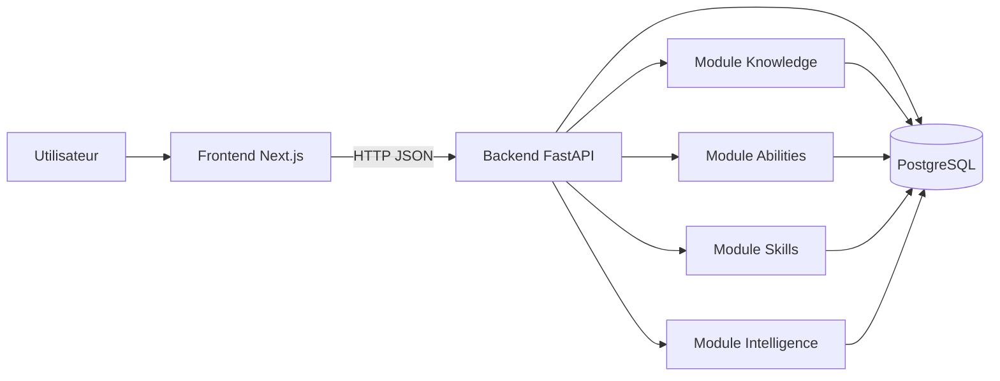
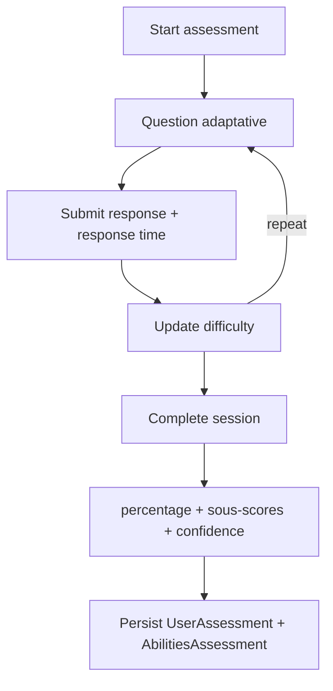
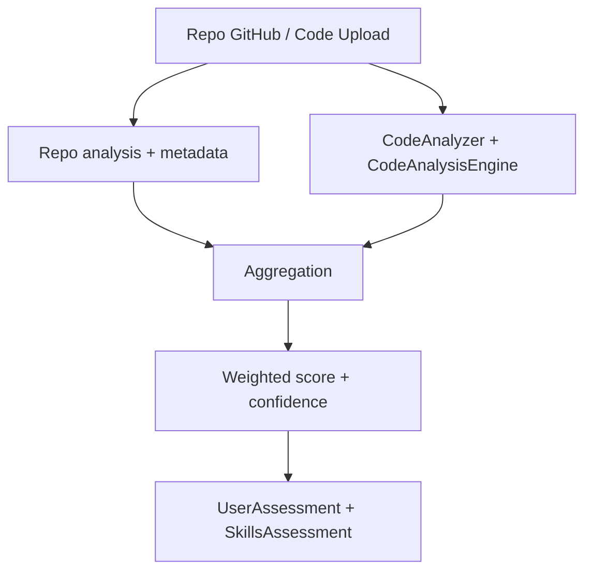
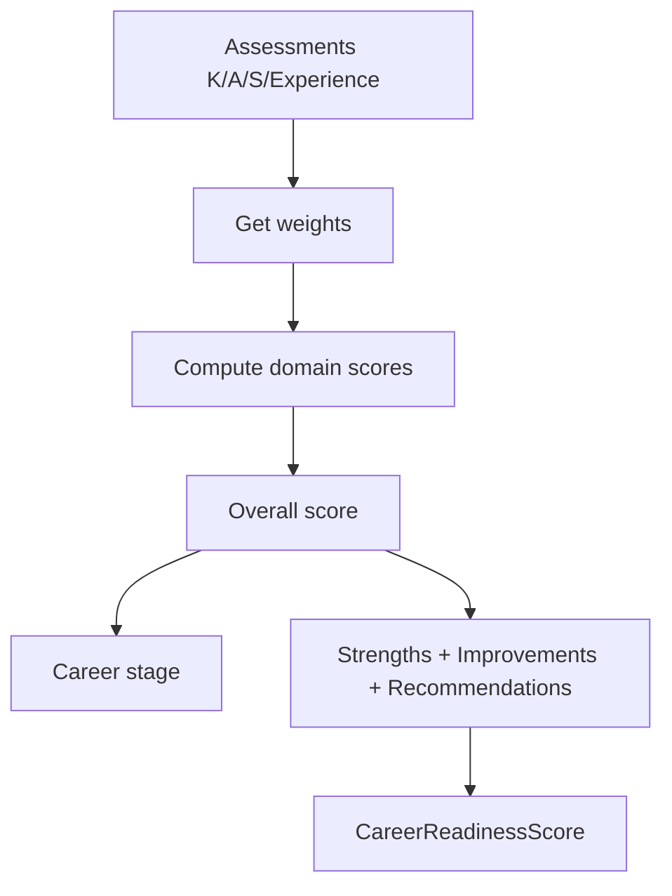

# Rapport détaillé — KASH Platform (modèles, méthodologie, résultats attendus)

## 1) Objectif du document
Ce rapport décrit l’application **KASH Platform** et les modèles/algorithmes utilisés dans chaque module **Knowledge**, **Abilities**, **Skills** et **Intelligence**, avec :
- Méthodologie (pipeline, features, scoring)
- Résultats attendus (sorties, interprétation)
- Pistes d’amélioration (évolutions possibles)
- Justification de recherche (pourquoi ces choix sont raisonnables)

Ce document s’aligne sur l’implémentation actuelle du backend.

---

## 2) Vue d’ensemble (architecture)



- **Frontend** : collecte les entrées (CV, quiz, repo GitHub / code upload), affiche scores + explications.
- **Backend** : exécute les pipelines d’analyse et calcule des scores normalisés.
- **DB** : stocke les évaluations (`UserAssessment`) et des détails par module.

---

## 3) Table de synthèse (modèles et sorties)

| Domaine | Entrées principales | Modèles / algorithmes | Sorties (principales) | Fichiers clés |
|---|---|---|---|---|
| Knowledge | Texte de CV | NLP extraction + enrichissement ESCO/O*NET + **TF-IDF + KNN (cosine)** | `normalized_score (0–100)`, `confidence_score (0–1)`, breakdown + skill gaps | `src/modules/knowledge/knowledge_service.py` + `src/modules/knowledge/nlp/cv_analyzer.py` |
| Abilities | Réponses quiz adaptatif | QuizEngine adaptatif + scoring en % + heuristique de confiance (consistance temps + incertitude) | `percentage (0–100)`, `confidence_score (0–1)`, sous-scores cognitifs | `src/modules/abilities/abilities_service.py` |
| Skills | Repo GitHub / fichiers code | Analyse repo + analyse code + agrégation pondérée + confiance data-quality | `normalized_score (0–100)`, `confidence_score (0–1)`, composantes (qualité, diversité, collab, etc.) | `src/modules/skills/skills_service.py` |
| Intelligence | Historique d’assessments (K/A/S + expérience) | **KASHScorer** (pondération + carrière) + **SHAPExplainer** (explicabilité) + ML optionnel (scikit-learn) | Score global, career stage, strengths/weaknesses, feature importance | `src/modules/intelligence/kash_scorer.py`, `src/modules/intelligence/shap_explainer.py`, `src/modules/intelligence/predictive_model/services/ml_service.py` |

---

## 4) Module Knowledge (K)

### 4.1 Inputs
- CV (texte) + métadonnées (nom de fichier, longueur)

### 4.2 Pipeline (méthodologie)
**Référence code** : `src/modules/knowledge/knowledge_service.py`

```mermaid
flowchart TD
  CV[CV Text] --> PRE[Pré-traitement + NLP]
  PRE --> EXT[Extraction (skills, exp, education, metadata)]
  EXT --> TAX[Enrichissement taxonomies (ESCO/O*NET)]
  TAX --> SIM[TF-IDF + KNN similarity (cosine)]
  SIM --> SCORE[Scoring pondéré + confidence]
  SCORE --> OUT[UserAssessment + KnowledgeAssessment]
```

### 4.3 Modèle de similarité TF-IDF + KNN
**Implémentation** : fonctions `compute_tfidf_knn_score`, `_preprocess`, `_build_tfidf`, `_cosine_similarity`.
- Nettoyage : suppression caractères spéciaux, tokens, stopwords, stemming simple.
- Vecteurs **TF-IDF** sur un petit corpus de référence.
- Similarité **cosinus** entre le CV et chaque document de référence.
- Score `knn_score` = moyenne des `k` meilleures similarités.

### 4.4 Score Knowledge (formule)
**Référence** : `KnowledgeService._calculate_knowledge_scores()`
- `parsing_confidence` (metadata)
- `skill_score` (match ratio + avg confidence)
- `occupation_score` (match ratio + avg confidence)
- `experience_score` (min(len(experience)/5, 1.0))
- `education_score` (règle heuristique par diplôme)
- `knn_score` (TF-IDF/KNN)

Formule (score brut 0–1) :
- `raw_score = 0.15*parsing_confidence + 0.25*skill_score + 0.30*knn_score + 0.15*occupation_score + 0.10*experience_score + 0.05*education_score`
- `normalized_score = raw_score * 100`

Confiance (0–1) :
- `confidence_score = min(1.0, 0.3*parsing_confidence + 0.4*taxonomy_quality + 0.3*knn_score)`

### 4.5 Résultats attendus
- Score de connaissance robuste même quand l’enrichissement ESCO/O*NET est partiel (car `knn_score` apporte un signal).
- Décomposition en sous-axes (qualité parsing, matching skills, similarité, expérience, etc.).
- Liste de `skill_gaps` quand l’alignement taxonomy échoue.

### 4.6 Pistes d’amélioration
- Remplacer le corpus fixe par un corpus dynamique par domaine/industrie.
- Remplacer TF-IDF par embeddings (SBERT) + ANN (FAISS) pour meilleure sémantique.
- Ajouter détection multi-langue + normalisation par langue.

### 4.7 Justification (recherche)
- TF-IDF + cosinus est un **baseline** classique en IR/NLP (interprétable, rapide, stable).
- KNN sur similarité permet une mesure simple de proximité à des profils de référence.
- La combinaison de signaux (parsing + taxonomy + similarity) réduit la sensibilité aux erreurs d’extraction.

---

## 5) Module Abilities (A)

### 5.1 Inputs
- Sessions de quiz adaptatifs (domaines cognitifs)

### 5.2 Pipeline (méthodologie)
**Référence code** : `src/modules/abilities/abilities_service.py`



### 5.3 Score Abilities
- Score final normalisé : `assessment.normalized_score = results.get('percentage', 0)`

**Confiance (0–1)** : `AbilitiesService._calculate_confidence_score()`
- Base : `0.7`
- + consistance temps (variance des temps de réponse)
- + (1 - incertitude) si `adaptive_results.ability_uncertainty` présent
- Capé à 1.0

### 5.4 Résultats attendus
- Mesure comparable inter-utilisateurs via normalisation `0–100`.
- Confiance plus élevée si la session est stable (temps de réponse cohérent) et si l’incertitude adaptative est faible.

### 5.5 Pistes d’amélioration
- Remplacer heuristiques par un modèle psychométrique (IRT 1PL/2PL) si dataset suffisant.
- Ajout de calibration par langue/culture et détection d’effets de vitesse.

### 5.6 Justification (recherche)
- Les tests adaptatifs reposent sur le principe de présenter des items dont la difficulté s’ajuste au niveau estimé.
- La stabilité des temps et l’incertitude sont des proxies raisonnables de fiabilité quand on n’a pas encore de calibration IRT.

---

## 6) Module Skills (S)

### 6.1 Inputs
- Analyse GitHub (repo) ou upload de code

### 6.2 Pipeline (méthodologie)
**Référence code** : `src/modules/skills/skills_service.py`



### 6.3 Scoring (repo GitHub)
**Référence** : `SkillsService._calculate_skills_scores()`

Composantes (0–100) :
- `code_quality`, `skill_proficiency`, `technical_diversity` (depuis `code_analysis.overall_scores`)
- `collaboration_score` (base 50 + bonus collaboration/auteurs)
- `complexity_score` (min(project_complexity*10, 100))
- `activity_score` (min(avg_commits_per_week*2, 100))

Score brut (pondéré) :
- `raw_score = 0.25*code_quality + 0.25*skill_proficiency + 0.15*technical_diversity + 0.15*collaboration_score + 0.10*complexity_score + 0.10*activity_score`
- `normalized_score = min(raw_score, 100)`

Confiance (0–1) (data-quality) : base 0.5, +0.2 si fichiers analysés, +0.1 si languages, +0.1 si commits, +0.1 si collaboration.

### 6.4 Scoring (upload code uniquement)
**Référence** : `SkillsService._calculate_skills_scores_from_code_analysis()`
- `raw_score = 0.3*code_quality + 0.3*skill_proficiency + 0.2*technical_diversity + 0.2*best_practices`
- Confiance : `min(0.3 + files_analyzed*0.02, 1.0)`

### 6.5 Résultats attendus
- Score stable si suffisamment de fichiers/commits.
- Breakdown actionnable (qualité, diversité, activité, collaboration).

### 6.6 Pistes d’amélioration
- Ajouter normalisation par taille projet (éviter biais gros projets).
- Ajouter détection de qualité via linters/CI, couverture tests, complexité cyclomatique.
- Ajouter attribution reliability (commits vs contributions réelles) plus systématique.

### 6.7 Justification (recherche)
- Les métriques “engineering” (activité, diversité, qualité) sont corrélées à la maturité technique.
- La combinaison pondérée donne un score interprétable et facilement debug.

---

## 7) Module Intelligence (I)

### 7.1 Rôle
Le module Intelligence agrège l’historique K/A/S (+ signal d’expérience) pour produire un score global de préparation carrière, des recommandations et des explications.

### 7.2 Scoring global (KASHScorer)
**Référence code** : `src/modules/intelligence/kash_scorer.py`



- Poids par défaut : Knowledge 0.25, Abilities 0.25, Skills 0.30, Experience 0.20
- Ajustements industrie : ex. `technology` augmente le poids Skills.
- Normalisation : somme des poids à 1.0.

Score global :
- `overall_score = Σ(domain.normalized_score * domain.weight)`

Confidence globale : moyenne des confiances de domaine.

Career stage (seuils) :
- explorer [0–40), beginner [40–55), intermediate [55–70), advanced [70–85), expert [85–100]

### 7.3 Explainability (SHAPExplainer)
**Référence code** : `src/modules/intelligence/shap_explainer.py`

- Le système fournit une explication “SHAP-like” (simplifiée) via des poids de features par domaine.
- Il produit des `FeatureImportance` (top 10) avec direction (positive/négative) et texte d’explication.

### 7.4 Modèles prédictifs optionnels (scikit-learn)
**Référence** : `src/modules/intelligence/predictive_model/services/ml_service.py`

- Algorithmes : RandomForest, GradientBoosting, LogisticRegression, SVM, MLP (classification/régression)
- Évaluation : accuracy/precision/recall/F1/AUC (classification), MSE/RMSE/MAE/R2 (régression)
- Explainability : feature_importances_ / coef_ / SHAP si disponible.

### 7.5 Résultats attendus
- Un score global cohérent, modulable par industrie.
- Des recommandations actionnables (forces/faiblesses) et un niveau (career stage).
- Une explication des facteurs principaux (feature importance).

### 7.6 Pistes d’amélioration
- Remplacer “SHAP-like” par SHAP réel sur un modèle entraîné (si dataset + modèle stable).
- Ajouter calibration des scores entre cohortes (fairness, drift).
- Définir un vrai composant “Experience” alimenté par données structurées (stages, projets, etc.).

### 7.7 Justification (recherche)
- L’agrégation pondérée est un choix standard quand on combine des dimensions hétérogènes.
- L’explicabilité (même approximative) est essentielle pour l’adoption (transparence, confiance utilisateur).
- Les modèles scikit-learn offrent un bon trade-off : rapides, interprétables, exploitables sur petits datasets.

---

## 8) Annexes — Références d’implémentation (backend)
- Knowledge : `src/modules/knowledge/knowledge_service.py`
- Abilities : `src/modules/abilities/abilities_service.py`
- Skills : `src/modules/skills/skills_service.py`
- Intelligence scoring : `src/modules/intelligence/kash_scorer.py`
- Explainability : `src/modules/intelligence/shap_explainer.py`
- Predictive ML : `src/modules/intelligence/predictive_model/services/ml_service.py`
